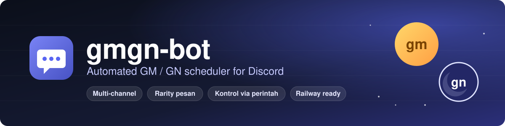
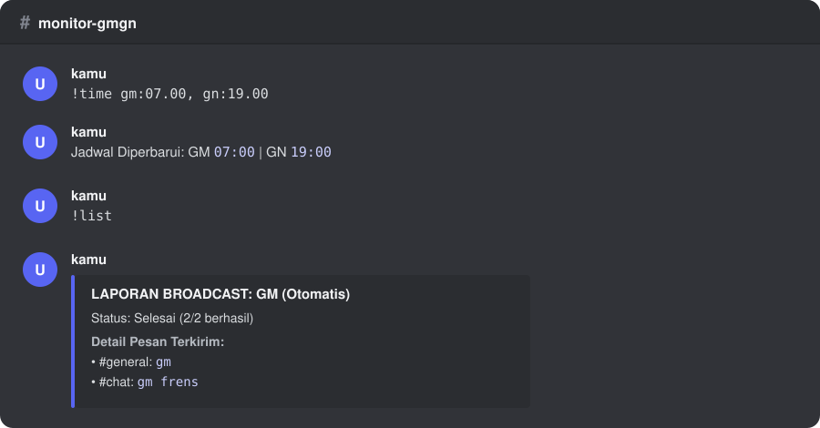
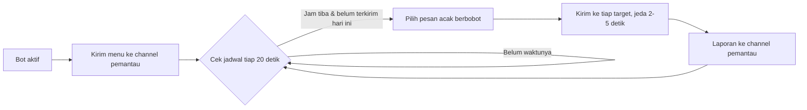

<div align="center">



<br>


**[Fitur](#fitur) · [Mulai Cepat](#mulai-cepat) · [Perintah](#perintah) · [Konfigurasi](#konfigurasi) · [Deploy](#deploy-ke-railway) · [Troubleshooting](#troubleshooting)**

</div>

<br>

> Kirim pesan **GM** dan **GN** otomatis ke banyak channel Discord pada jam yang kamu tentukan, lalu atur semuanya langsung dari Discord lewat perintah `!`, tanpa edit file dan tanpa deploy ulang.

<br>

<div align="center">

<br>
<sub>Ilustrasi channel pemantau: pengaturan lewat perintah dan laporan otomatis setelah pengiriman.</sub>
</div>

<br>

## Fitur

| | |
| --- | --- |
| **Pesan berbobot (rarity)** | 12 variasi GM dan 12 variasi GN. Bentuk singkat `gm` / `gn` muncul paling sering (sekitar 29%), variasi lain lebih jarang. |
| **Multi-channel** | Satu jadwal dikirim ke semua channel target dengan jeda acak 2-5 detik antar channel. |
| **Jadwal fleksibel** | Jam GM dan GN diatur terpisah (24 jam) dan mengikuti zona waktu pilihanmu. |
| **Anti kirim ganda** | Tiap jadwal hanya terkirim sekali per hari, dengan jendela toleransi 15 menit. |
| **Laporan otomatis** | Setelah pengiriman, bot melapor ke channel pemantau: jumlah berhasil, pesan terkirim, dan channel yang gagal. |
| **Konfigurasi persisten** | Pengaturan tersimpan di `config.json` (Railway Volume `/data`) dan bertahan saat restart atau redeploy. |
| **Akses terkunci** | Perintah hanya diproses dari akun pemilik token dan hanya di channel pemantau. |
| **Siap produksi** | Kode modular dan ber-tes, ada `Dockerfile`, dan `railway.json` dengan restart otomatis. |

## Mulai Cepat

Cara tercepat adalah deploy ke Railway:

1. **Push** repositori ini ke GitHub akunmu.
2. Di [Railway](https://railway.app/): **New Project → Deploy from GitHub repo**, pilih repositori ini.
3. Isi tab **Variables**:

   ```env
   DISCORD_USER_TOKEN=token_akun_discord
   MONITOR_CHANNEL_ID=123456789012345678
   TIMEZONE=Asia/Jakarta
   ```

4. Tambahkan **Volume** dengan mount path `/data`.
5. Setelah status **Active**, menu bot muncul di channel pemantau. Lanjut atur target dan jadwal:

   ```text
   !set 1234567890 0987654321
   !time gm:07.00, gn:19.00
   !test gm
   ```

## Cara Kerja



- Jadwal dicek setiap **20 detik**.
- Pesan dikirim bila waktu sekarang berada **0-15 menit setelah** jam jadwal dan belum terkirim pada tanggal itu. Jendela ini menjaga jadwal tetap terkirim walau bot baru menyala beberapa menit setelahnya.
- Tanpa channel target, tidak ada yang dikirim.
- Zona waktu yang tidak valid otomatis memakai `Asia/Jakarta`.

## Perintah

Ketik di **channel pemantau**, dari akun yang sama dengan token bot.

| Perintah | Fungsi | Contoh |
| --- | --- | --- |
| `!menu` | Menampilkan daftar perintah | `!menu` |
| `!set <id> [<id> ...]` | Menambah satu atau banyak channel target | `!set 1234567890 0987654321` |
| `!stop <id>` | Menghapus satu channel dari target | `!stop 1234567890` |
| `!time gm:<jam>, gn:<jam>` | Mengatur jam GM dan/atau GN (24 jam, pemisah `.` atau `:`) | `!time gm:07.00, gn:19.00` |
| `!list` | Menampilkan jadwal aktif dan daftar target | `!list` |
| `!test gm` / `!test gn` | Pengiriman manual ke semua target untuk uji coba | `!test gm` |

**Catatan:** `!time` boleh berisi salah satu saja (mis. `!time gn:21.30`), bagian lain tidak berubah. Nilai awal: GM `07:00`, GN `19:00`, tanpa target. `!set` dan `!stop` hanya menerima ID berupa angka.

## Konfigurasi

### Environment variable

| Variabel | Wajib | Default | Keterangan |
| --- | :---: | --- | --- |
| `DISCORD_USER_TOKEN` | Ya | kosong | Token akun Discord. Bila kosong, bot berhenti tanpa pesan error. |
| `MONITOR_CHANNEL_ID` | Disarankan | `0` | ID channel pemantau. Nilai `0` membuat perintah berlaku di semua channel dan laporan tidak dikirim ke Discord. |
| `TIMEZONE` | Tidak | `Asia/Jakarta` | Zona waktu jadwal, mis. `Asia/Makassar`, `Asia/Jayapura`, `UTC`. |

> [!NOTE]
> `MONITOR_CHANNEL_ID` harus berupa angka murni. Nilai berisi huruf atau spasi membuat bot berhenti saat startup.
> File `.env` **tidak** dibaca otomatis; `.env.example` hanya contoh. Isi variabel lewat Railway Variables atau shell.

### File konfigurasi

Pengaturan dari perintah disimpan ke `config.json`:

```json
{
    "gm_time": "07:00",
    "gn_time": "19:00",
    "target_channels": [1234567890, 987654321]
}
```

Lokasi: `/data/config.json` bila folder `/data` ada (Railway Volume), jika tidak `./config.json` di direktori kerja.

## Deploy ke Railway

Langkah singkat ada di [Mulai Cepat](#mulai-cepat). Yang sudah diatur di `railway.json`:

- Build memakai `Dockerfile`.
- Start command: `python -m gmgn_bot`.
- Restart otomatis saat gagal, maksimal 10 kali.

> [!WARNING]
> Jangan mengisi *Custom Start Command* di dashboard Railway dengan awalan `PYTHONPATH=...`. Railway menjalankannya tanpa shell sehingga muncul error `The executable pythonpath=src could not be found`. Paket sudah terpasang lewat `pip install .` di Dockerfile, jadi tidak diperlukan.

<details>
<summary><b>Menjalankan secara lokal</b></summary>

<br>

Prasyarat: Python 3.10+ dan Git (dependensi `discord.py-self` diambil dari GitHub).

```bash
git clone https://github.com/akndrn000/gmgn-bot.git
cd gmgn-bot
python -m venv .venv
```

Aktifkan virtual environment dan pasang dependensi:

```bash
# Windows (PowerShell)
.venv\Scripts\Activate.ps1
# Linux / macOS
source .venv/bin/activate

pip install -r requirements.txt
pip install -e .
```

Atur variabel lalu jalankan:

```powershell
# Windows (PowerShell)
$env:DISCORD_USER_TOKEN = "token_anda"
$env:MONITOR_CHANNEL_ID = "123456789012345678"
$env:TIMEZONE = "Asia/Jakarta"
python -m gmgn_bot
```

```bash
# Linux / macOS
export DISCORD_USER_TOKEN="token_anda"
export MONITOR_CHANNEL_ID="123456789012345678"
export TIMEZONE="Asia/Jakarta"
python -m gmgn_bot
```

Dengan Docker:

```bash
docker build -t gmgn-bot .
docker run --rm \
  -e DISCORD_USER_TOKEN=... \
  -e MONITOR_CHANNEL_ID=... \
  -e TIMEZONE=Asia/Jakarta \
  gmgn-bot
```

</details>

<details>
<summary><b>Struktur proyek</b></summary>

<br>

```text
gmgn-bot/
├── src/gmgn_bot/
│   ├── __main__.py        # Titik masuk: python -m gmgn_bot
│   ├── settings.py        # Membaca environment variable
│   ├── storage.py         # Baca/tulis config.json
│   ├── messages.py        # Daftar pesan GM/GN, bobot rarity, teks menu
│   ├── scheduler.py       # Aturan jadwal dan pengiriman broadcast
│   ├── commands.py        # Handler !menu !set !time !list !stop !test
│   ├── client.py          # Client Discord, event, dan loop jadwal
│   └── logging_setup.py   # Konfigurasi logging
├── tests/                 # Tes pytest
├── docs/                  # Aset README (banner, pratinjau)
├── .env.example           # Contoh variabel lingkungan
├── Dockerfile             # Image container
├── Procfile               # Perintah worker
├── railway.json           # Konfigurasi build dan deploy Railway
├── pyproject.toml         # Metadata paket, konfigurasi ruff dan pytest
├── requirements.txt       # Dependensi runtime (versi disematkan)
└── requirements-dev.txt   # Dependensi development
```

</details>

<details>
<summary><b>Testing dan lint</b></summary>

<br>

```bash
pip install -r requirements-dev.txt
pytest
ruff check .
ruff format --check .
```

Tes mencakup parser perintah, aturan jadwal, pemilihan pesan berbobot, penyimpanan konfigurasi, dan konfigurasi deploy. Tidak ada tes yang terhubung ke Discord.

</details>

## Troubleshooting

| Gejala | Kemungkinan penyebab | Solusi |
| --- | --- | --- |
| Deploy gagal: `The executable pythonpath=src could not be found` | Custom Start Command lama di dashboard Railway | Kosongkan atau ganti menjadi `python -m gmgn_bot` di Settings → Deploy |
| Status **Active** tetapi tidak ada menu di Discord | Token kosong, salah, atau kedaluwarsa; `MONITOR_CHANNEL_ID` salah; akun tidak punya akses ke channel | Periksa Variables dan Deploy Logs |
| Bot langsung berhenti saat start | `MONITOR_CHANNEL_ID` bukan angka | Isi dengan ID channel berupa angka |
| Perintah `!` tidak direspons | Diketik di luar channel pemantau atau dari akun lain | Ketik di channel pemantau memakai akun pemilik token |
| Jadwal tidak terkirim | Belum ada target, atau jam sudah lewat lebih dari 15 menit | Cek `!list`, tambah target dengan `!set`, uji dengan `!test gm` |
| Jam bergeser | `TIMEZONE` tidak sesuai | Atur zona waktu yang benar, mis. `Asia/Makassar` |
| Konfigurasi hilang setelah redeploy | Volume belum terpasang | Tambahkan Volume dengan mount path `/data` |

## Keamanan dan Disclaimer

> [!CAUTION]
> **Self-bot melanggar Terms of Service Discord.** Memakai token akun pengguna untuk otomatisasi dapat berujung pada pembatasan atau penonaktifan akun. Gunakan dengan risiko sendiri, dan sebaiknya jangan pada akun utama yang penting.

- Perlakukan token seperti kata sandi: jangan dibagikan, jangan di-commit, jangan ditempel di issue atau tangkapan layar. Isi hanya lewat environment variable. Bila token bocor, segera amankan akun dan ganti kata sandi.
- Periksa repositori dan log sebelum push agar tidak memuat token.
- Proyek ini tidak berafiliasi dengan, disponsori, atau didukung oleh Discord Inc. maupun Railway Corp. Semua nama dan merek dagang adalah milik pemiliknya masing-masing.
- Perangkat lunak disediakan apa adanya, tanpa jaminan apa pun.

## Lisensi

Dirilis di bawah [Lisensi MIT](./LICENSE).
